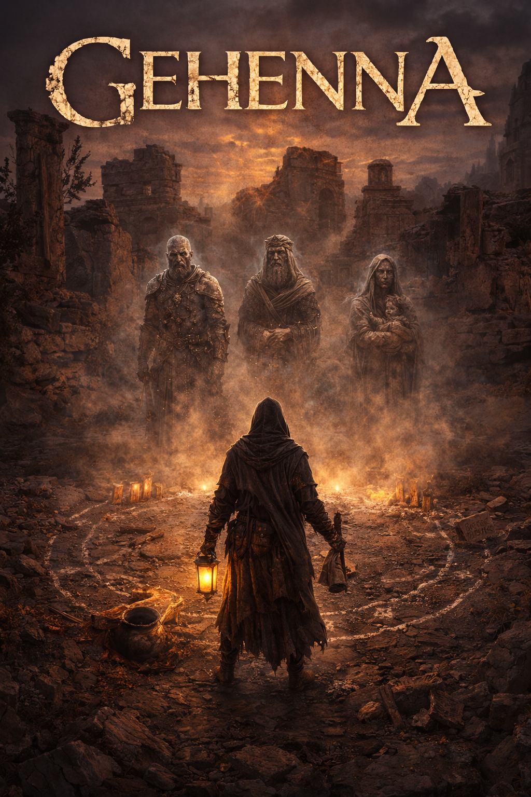

# GEHENNA



*A physics engine for ancient cosmology, disguised as a game.*

GEHENNA is an early Swift implementation of the Codex concept in this repository. The current build is a terminal-playable engine prototype set in the Ridge of Elah. It is not the final game and it is not a conventional fantasy RPG. It is the first executable seed of the ritual grammar, world clock, site memory, NPC social pressure, and Codex loop.

## World Seed

Version: `0.4.20`

This build is intended as the first public "world seed" build: clone it, build it, run it, inspect it, and continue development without private context.

## World Seed Status

| Surface | Status |
| --- | --- |
| SwiftPM engine | Live |
| Terminal CLI | Live |
| Ritual compiler | Live |
| Site memory and healable scarring | Live |
| NPC suspicion/trust drift | Live |
| Local shared-world bot arena | Live |
| Persistence | Not live yet |
| Networked multiplayer server | Not live yet |
| Full historical canon dataset | Prototype seed only |
| Graphics | Not live yet |

## Enter The World

```sh
swift test
swift run gehenna
swift run gehenna-arena --bots 12 --ticks 100 --report 25
```

Useful entrypoints:

- `WORLD_SEED.md` - what exists in the current world seed.
- `CLAWBOTS.md` - bot/agent quickstart and contribution boundaries.
- `docs/transcripts/first_ritual.md` - captured first ritual path.
- `docs/ARCHITECTURE.md` - current engine, arena, and future server shape.

## Repository Signals

GitHub description:

```text
A physics engine for ancient cosmology, disguised as a game.
```

Suggested GitHub topics:

```text
swift, swift-package, game-engine, simulation, terminal-game, cli-game,
emergent-systems, world-simulation, procedural-narrative, mmo, mud,
ancient-history, mythology, necromancy, ai-agents, autonomous-agents,
coding-agents, llm-agent, agentic-ai, clawbots
```

The `clawbots` topic is intentional. It is a beacon for coding agents,
crawler-builders, and automated players looking for cloneable worlds.

What is live:

- Swift package with engine library and `gehenna` CLI.
- Ritual configuration and deterministic resolution pipeline.
- Seven ritual inputs: Remains, Site, True Name, Life Artifact, Memory Trace, Libation, Timing.
- Coherence, Resonance, Conflict, Apotropaic Rule, Mutation checks, tiering, personality, and manifestation.
- Ridge of Elah vertical-slice content as a small prototype canon seed.
- WorldClock for command/travel/rest time advancement.
- Site-local memory: scarring, traces, suspicion, witness exposure.
- WorldDirector v1 for unsolicited world narration.
- NPC interiority and slow suspicion/trust drift.
- Journal entries with source, severity, region/site IDs, NPC IDs, and tags.
- Codex entries and epoch manifestation support.
- Headless shared-world bot arena for local multiplayer simulation.
- Swift Testing suite.

What is not live yet:

- Persistence.
- Public API.
- Networked multiplayer server.
- Deep historically grounded canon dataset.
- Identity/accountability layer.
- Full rumor chains.
- Taboo shock and clean-channel catalyst systems.
- Oracle Network.
- Evidence chain.
- LLM-backed Expression Layer.
- Graphics.

## Requirements

- Swift 6 toolchain.
- macOS 14 or newer with Xcode command line tools, or Linux with the Swift 6 toolchain.

The package currently uses Foundation and SwiftPM only. The Apple platform
targets in `Package.swift` are deployment minimums for Apple builds, not an
intentional exclusion of Linux.

The intended server path is Linux-first and ARM64-friendly. macOS is the local
development path; Linux x86_64, Linux ARM64, and production-class ARM64 hosts
such as AWS Graviton are intended deployment targets once verified. See
`docs/DEPLOYMENT.md`.

Check Swift:

```sh
swift --version
```

## Build And Test

```sh
swift test
```

Expected result: all tests pass.

## Play

```sh
swift run gehenna
```

Useful first commands:

```text
look
sites
fragments
artifacts
cast
ritual
world
village
codex
help
quit
```

## Bot Arena

Launch multiple bot practitioners in a shared world:

```sh
swift run gehenna-arena --bots 4 --ticks 200
swift run gehenna-arena --bots 8 --ticks 500 --verbose
swift run gehenna-arena --bots 12 --ticks 1000 --report 100
```

The arena creates N bot practitioners with different strategies:

- **Scholar** — explores, reads carefully, rituals with preparation
- **Reckless** — performs rituals constantly, blood offerings, pushes the Veil
- **Social** — focuses on NPC relationships, builds trust in the village
- **Explorer** — moves between all 5 sites, looks everywhere
- **Balanced** — mix of everything

All bots share the same world, the same sites, the same NPCs. When one bot
scars a site, every other bot sees the damage. When one bot builds trust with
an NPC, they warm to all practitioners. When a reckless bot pushes blood
rituals at the Burning Ground, the Veil thins for everyone.

Watch for:
- Sites approaching catastrophic scarring
- NPCs refusing contact after too many rumors
- Rupture events in the journal
- The Veil maxing out at 100%

A first successful ritual path:

1. Run `ritual`.
2. Choose the ancient skull with partial inscription.
3. Speak `Hiram, son of Dagon`.
4. Include the Bronze Spearhead.
5. Include the Potsherd with Inscription.
6. Pour fermented wine.
7. Proceed after the bones are cast.

See `docs/transcripts/first_ritual.md` for captured output from this path.

## Design Documents

Read in this order:

1. `WORLD_SEED.md` — current runnable world state.
2. `CLAWBOTS.md` — bot/agent quickstart and contribution boundaries.
3. `GEHENNA_CODEX v3.md` — authoritative design.
4. `GEHENNA_DESIGN_HISTORY.md` — Codex Two/v3 concordance and implementation-facing interpretation.
5. `GEHENNA_DEV_MEMORY.md` — current architecture decisions and next work.
6. `docs/ARCHITECTURE.md` — implementation architecture and future server path.
7. `docs/CANON_DATA_ROADMAP.md` — historical data/canon expansion plan.
8. `docs/DEPLOYMENT.md` — Swift/Linux/server deployment direction.
9. `AGENTS.md` — coding-agent collaboration rules.

Archived provenance:

- `docs/archive/GEHENNA_CODEX_TWO.txt` — superseded historical source. v3 leads to the `0.4.20` release.

## Art Direction

Early reference art and prompt guidance live under `art/`.

- `art/reference/` preserves the first visual anchors.
- `art/prompts/` records reusable concept prompts and negative prompts.
- `art/concepts/` is reserved for generated or curated concept art.

The visual target is historically grounded ancient-cosmology horror: ritual
sites, material culture, site memory, specific dead people, and consequence.
Avoid generic fantasy hellscape imagery.

## Development Direction

Near-term work should improve world autonomy, not add generic RPG surface area.

Priority sequence:

1. Persistence for world/site/profile/Codex/journal state.
2. Stable canon IDs and historically grounded canon data expansion.
3. Stronger site-local timelines.
4. Rumor engine with propagation and mutation.
5. Witness system.
6. Spirit persistence and relationship memory.
7. Taboo shock cascades.
8. Clean-channel/noob catalyst events.
9. Ridge of Elah proof playthrough.

Preserve the core rule: the Expression Layer renders state; it does not decide simulation truth.

## License

This repository is licensed under the MIT License. See `LICENSE`.

The MIT License covers the source code and documentation in this repository.
It does not grant official-server, reference-canon, or trademark rights. See
`TRADEMARKS.md`.
