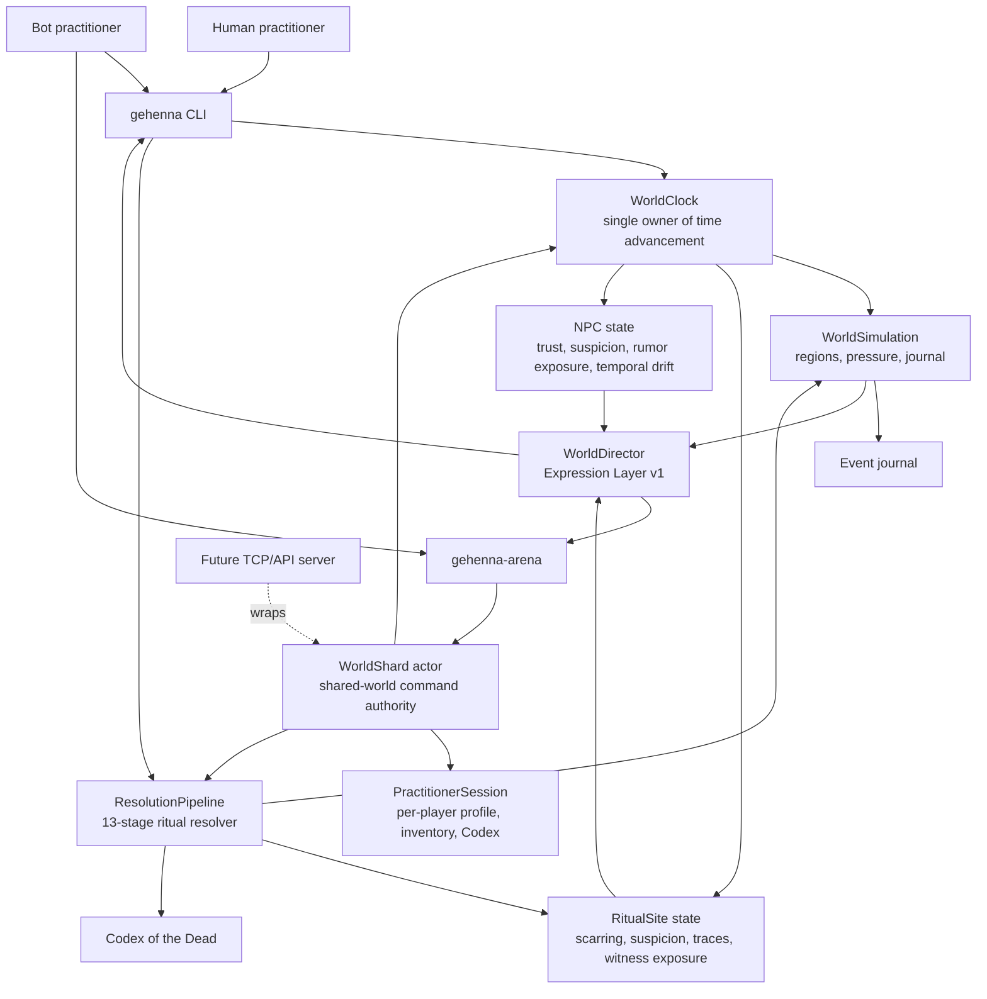
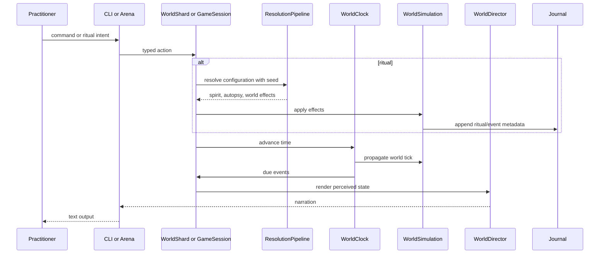

# GEHENNA Architecture

This is the current implementation shape for the `0.4.21` world seed.



## Current Rule

The Expression Layer renders state. It does not decide simulation truth.

`WorldDirector` is the current Expression Layer v1. It reads state and chooses authored narration. It does not mutate world state.

## Command Flow



## Current Boundaries

- `GehennaEngine` should stay portable and free of Apple-only APIs.
- `WorldClock` owns time advancement.
- `WorldShard` is the shared-world authority for local multiplayer simulation.
- `ResolutionPipeline` remains deterministic for a given ritual configuration, world pre-state, profile, and seed.
- The journal is the future persistence/replay spine, but it is not persisted yet.
- Site scarring is durable but healable.
- Arena bots are a stress harness, not final player behavior.

## Future Server Path

The next server shape should wrap `WorldShard`, not fork command logic:

```text
authenticated intent
  -> player/session lookup
  -> regional or site action queue
  -> deterministic resolver
  -> event journal append
  -> world-state update
  -> cascade/routine consumers
  -> interest-filtered client notifications
```

Scaling should happen through ownership boundaries: site, region, region cluster, cosmological layer, or canon instance. Cross-boundary effects should propagate as events, not whole-world recalculations.
